# Highly available Web Application on a cloud provider with Ansible
[](https://github.com/nleiva/ansible-web-server/actions/workflows/ansible-lint.yml)

The goal is to provision one or more web server instances behind a load balancer on any cloud provider automatically. See the following image for an example on Azure. 

<p align="center">

</p>

## Requirements

- [AWS](aws.md)
- [Azure](azure.md)
- [GCP](gcp.md)


## Creating a Job Template to Deploy the Web Server(s)

Follow these steps to provision the Web Server(s).

1. Create a Project with for this repo (`https://github.com/nleiva/ansible-web-server`). I called the Project `Azure WebServer` in the example below.

<p align="center">
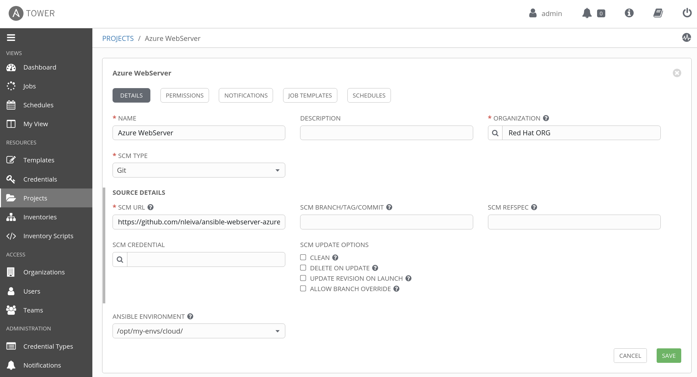
</p>

2. Create a [Microsoft Azure Resource Manager](https://docs.ansible.com/ansible-tower/latest/html/userguide/credentials.html#microsoft-azure-resource-manager) credential with your [Azure service principal parameters](https://docs.microsoft.com/en-us/azure/active-directory/develop/howto-create-service-principal-portal).

<p align="center">
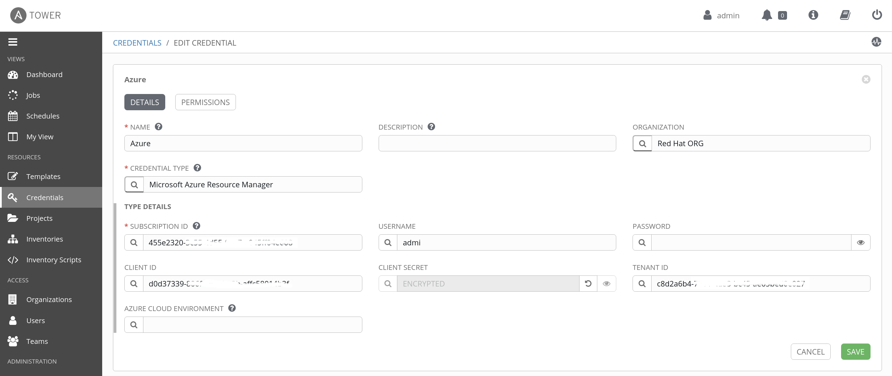
</p>

3. The number and operating system of the backend servers is defined via the variable `vms`. Its default value is defined in the [vms file](vars/vms.yml). It list 2 instances; one running `centos`, and the other one `ubuntu` (these are the two distributions supported at the moment). You can override this with a new `vms` definition as an [Extra Variable](https://docs.ansible.com/ansible-tower/latest/html/userguide/job_templates.html#extra-variables).

```yaml
vms:
  1: centos
  2: ubuntu
```

4. Put all these pieces together in a Job Template pointing to [main.yml](main.yml).

<p align="center">
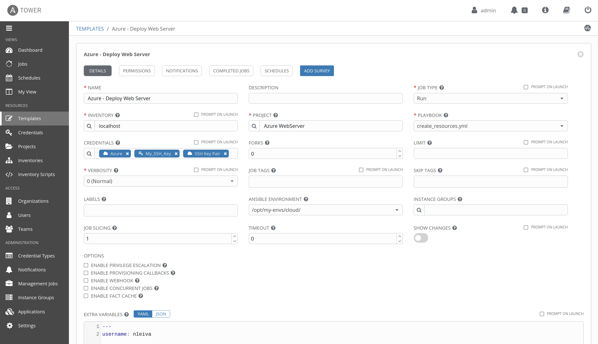
</p>

5. Run the Job Template.

<p align="center">
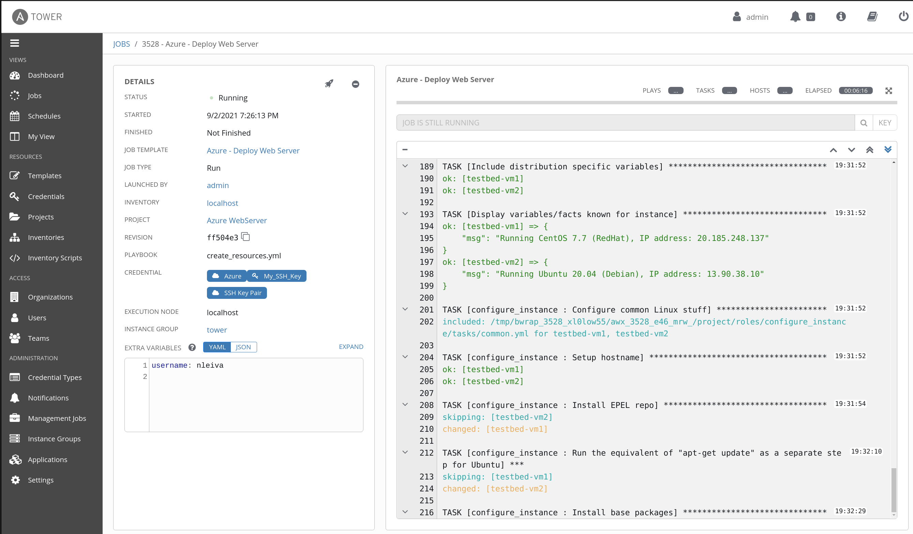
</p>

It should look like this when it finishes:

<p align="center">
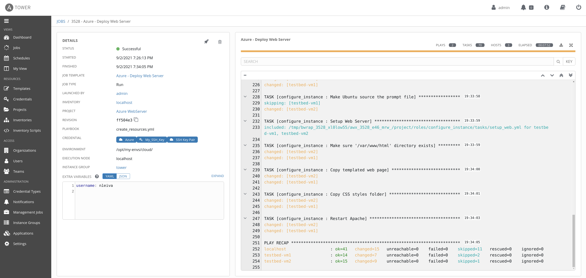
</p>

## Accessing the Web Server

We distribute the traffic among the instances using an [Azure Load Balancer](https://docs.microsoft.com/en-us/azure/load-balancer/load-balancer-overview) to prevent failure in case any of the virtual machines fail. By default the web server is at `http://testbed.eastus.cloudapp.azure.com/`. You can modify this with the variable `prefix`. Its default value is `testbed`.

This URL will take you to one of the backend VM's. For example:

### VM 1

<p align="center">
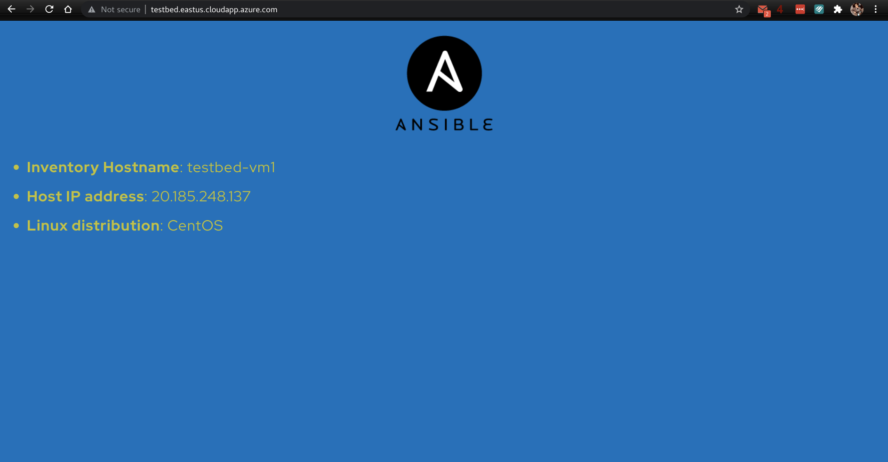
</p>

### VM 2

<p align="center">
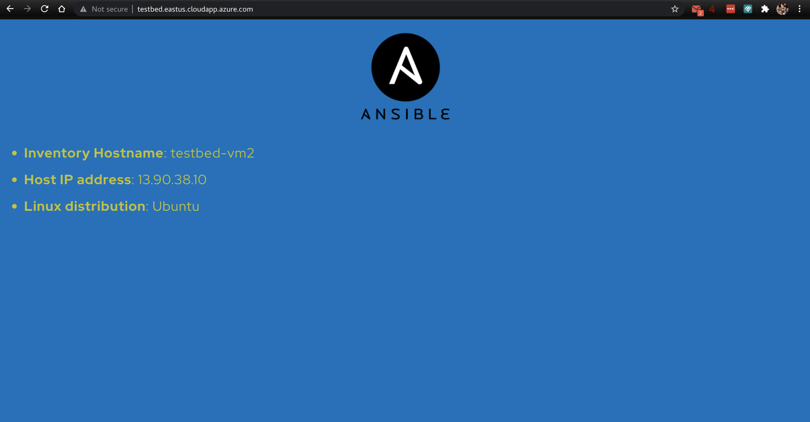
</p>

## Deleting the resources

You can create a similar Job Template pointing to [main.yml](main.yml) and pass an extra-var `delete=true`.

<p align="center">
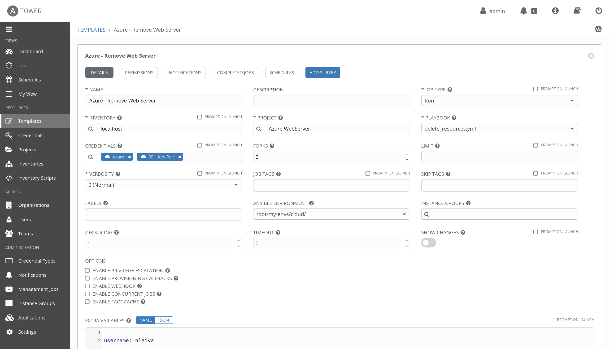
</p>

And run it.

<p align="center">
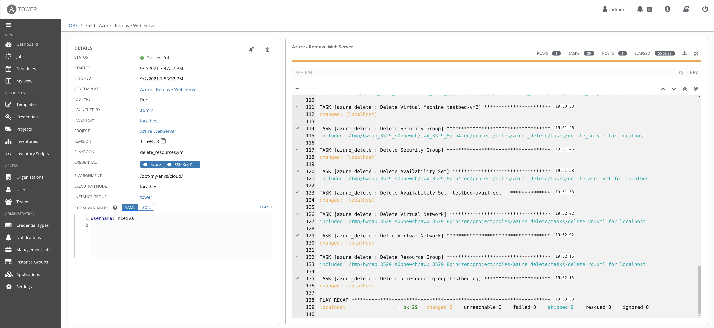
</p>

## Run from an Execution Environment

You can alternatively run this with [ansible-navigator](https://github.com/ansible/ansible-navigator#installing).

### EE Create Web Server

```bash
ansible-navigator run main.yml
```

<p align="center">
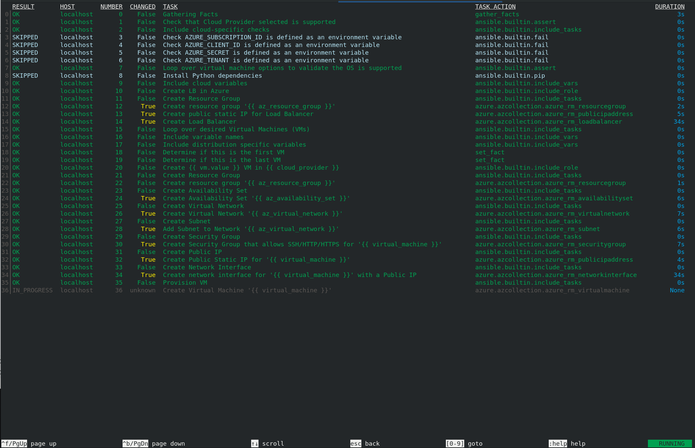
</p>

#### EE Create Web Server in another cloud provider with custom domain

```bash
ansible-navigator run main.yml -e "cloud=aws dns_zone=sandbox760.opentlc.com"
```

### EE Delete Web Server

```bash
ansible-navigator run main.yml -e "delete=true"
```

<p align="center">
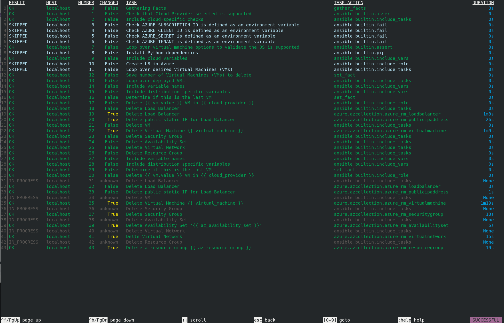
</p>

**Note**: I use [podman](https://podman.io/) as my container engine (`container-engine`). You can change to another alternative in the ansible [navigator config file](ansible-navigator.yml).

## Run from the Ansible Core CLI

Check [ansible_core](ansible_core.md).
