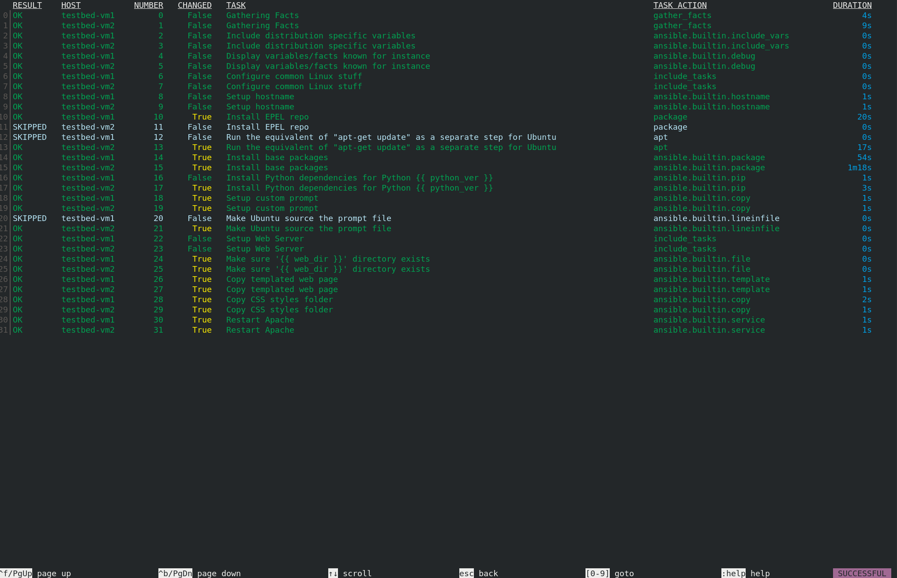

# Web Server in Azure with Ansible
[](https://github.com/nleiva/ansible-webserver-azure/actions/workflows/ansible-lint.yml)

The goal is to automatically provision a number of webserver instances behind a load balancer on Azure. These instances, while typically are identical to one another, we can make them a mix of different Linux distributions (just for fun). 

<p align="center">

</p>

## Requirements

### Azure credentials

To authenticate via service principal, provide these variables; `subscription_id`, `client_id`, `secret` and `tenant` or set them as environment variables;`AZURE_SUBSCRIPTION_ID`, `AZURE_CLIENT_ID`, `AZURE_SECRET` and `AZURE_TENANT`.

- `AZURE_SUBSCRIPTION_ID`: [Find your Azure subscription](https://docs.microsoft.com/en-us/azure/media-services/latest/setup-azure-subscription-how-to?tabs=portal)
- `AZURE_CLIENT_ID` and `AZURE_TENANT`: [Register an application with Azure AD and create a service principal](https://docs.microsoft.com/en-us/azure/active-directory/develop/howto-create-service-principal-portal#register-an-application-with-azure-ad-and-create-a-service-principal)
- `AZURE_SECRET`: [Create a new application secret](https://docs.microsoft.com/en-us/azure/active-directory/develop/howto-create-service-principal-portal#option-2-create-a-new-application-secret)

#### Azure credentials in Ansible Tower

<p align="center">

</p>

### SSH Public key

You need to provide your SSH Key pair, so Azure can add your public SSH Key to `~/.ssh/authorized_keys` in the instances it creates. Hence, Ansible can use the Private Key to configure these instances.

<p align="center">

</p>

## Creating a Job Template to Deploy the Web Server

Follow these steps to provision the Web Server.

1. Create a Project with this repo: `https://github.com/nleiva/ansible-webserver-azure`. I called the Project `Azure WebServer`.

2. Create a [Microsoft Azure Resource Manager](https://docs.ansible.com/ansible-tower/latest/html/userguide/credentials.html#microsoft-azure-resource-manager) with your [Azure service principal parameters](https://docs.microsoft.com/en-us/azure/active-directory/develop/howto-create-service-principal-portal); `AZURE_SUBSCRIPTION_ID`, `AZURE_CLIENT_ID`, `AZURE_SECRET`, and `AZURE_TENANT`.

3. The number and operating system of the backend servers is defined with the variable `vms`. Its default is defined in the [vms file](vars/vms.yml). It list 2 instances; one running `centos`, and the other one `ubuntu` (these are the two distributions supported at the moment). You can pass any other values as extra-vars

```yaml
vms:
  1: centos
  2: ubuntu
```

4. Put all this together in a Job Template pointing to [create_resources.yml](create_resources.yml).

<p align="center">

</p>

5. Run the Job Template.

<p align="center">

</p>

It should look like this when it finishes:

<p align="center">

</p>

## Accessing the Web Server

We distribute the traffic among the instances using an [Azure Load Balancer](https://docs.microsoft.com/en-us/azure/load-balancer/load-balancer-overview) to prevent failure in case any of the virtual machines fail. By default the web server is at `http://testbed.eastus.cloudapp.azure.com/`. You can modify this with the variable `prefix`, which by default is `testbed`.

This URL will take you to one of the backend VM's. For example:

### VM 1

<p align="center">

</p>

### VM 2

<p align="center">

</p>

## Deleting the resources

You can create a similar Job Template pointing to [delete_resources.yml](delete_resources.yml) instead.

<p align="center">

</p>

And run it.

<p align="center">

</p>

## Run from an Execution Environment

You can alternatively run this with [ansible-navigator](https://github.com/ansible/ansible-navigator#installing).

```bash
ansible-navigator run create_resources.yml
```
### EE Create Web Server

<p align="center">

</p>

### EE Delete Web Server

<p align="center">

</p>

**Note**: I use [podman](https://podman.io/) as my container engine (`container-engine`). You can change to another alternative in the ansible [navigator config file](ansible-navigator.yml).

## Run from the Ansible Core CLI

Check [ansible_core](ansible_core.md).
