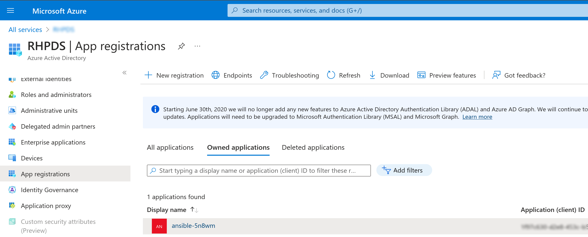
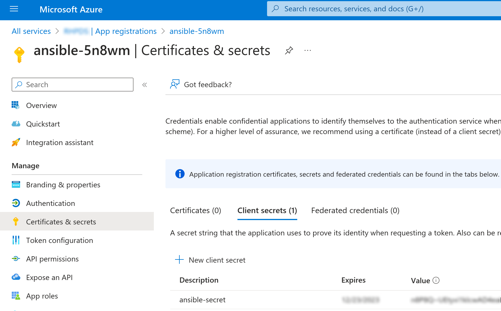
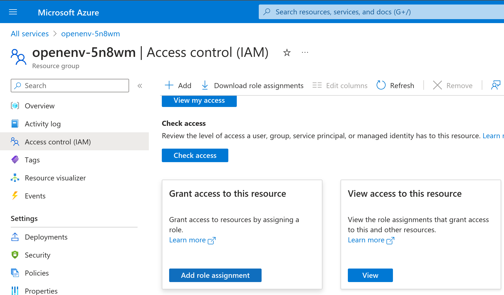
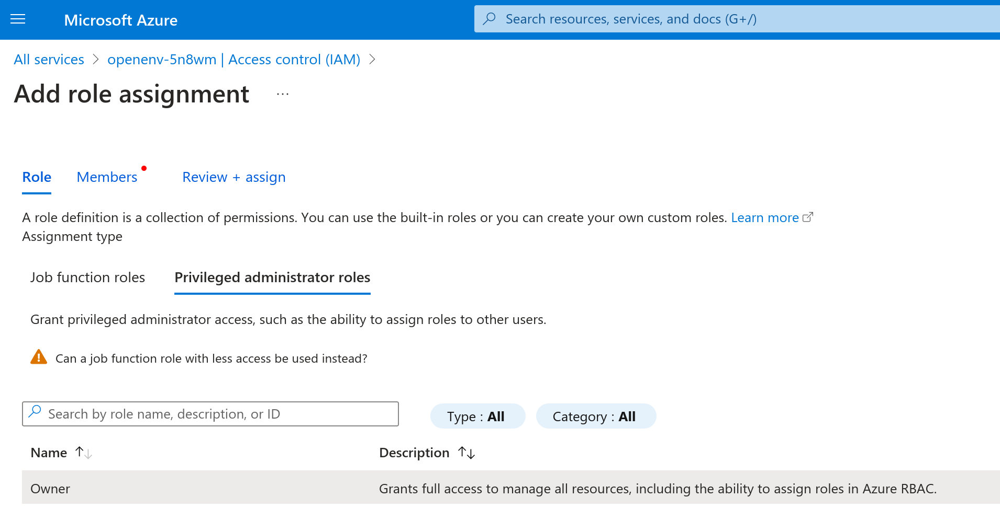
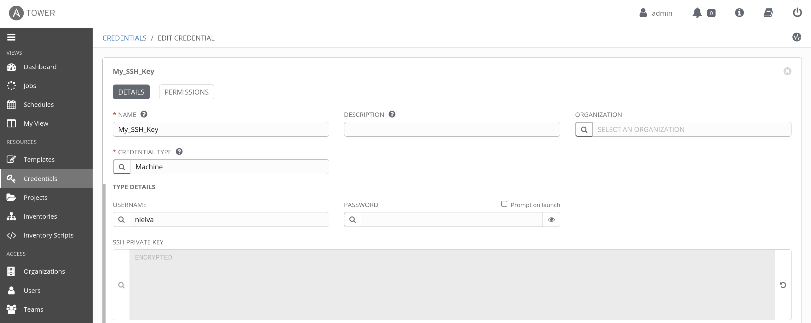

# Azure

## Python libraries

As we will interact with Azure, we need a couple of Python libraries to be present in the system.

```bash
pip install --user -r requirements_azure.txt
```

## Ansible Collections

We will also need the Ansible [collection for Azure](https://github.com/ansible-collections/azure#ansible-collection-for-azure).

```bash
ansible-galaxy collection install -r collections/requirements.yml
```

## Azure credentials

To authenticate via service principal, provide these variables; `subscription_id`, `client_id`, `secret` and `tenant` or set them as environment variables;`AZURE_SUBSCRIPTION_ID`, `AZURE_CLIENT_ID`, `AZURE_SECRET` and `AZURE_TENANT`.

- `AZURE_SUBSCRIPTION_ID`: [Find your Azure subscription](https://docs.microsoft.com/en-us/azure/media-services/latest/setup-azure-subscription-how-to?tabs=portal)
- `AZURE_CLIENT_ID` and `AZURE_TENANT`: [Register an application with Azure AD and create a service principal](https://docs.microsoft.com/en-us/azure/active-directory/develop/howto-create-service-principal-portal#register-an-application-with-azure-ad-and-create-a-service-principal)
- `AZURE_SECRET`: [Create a new application secret](https://docs.microsoft.com/en-us/azure/active-directory/develop/howto-create-service-principal-portal#option-2-create-a-new-application-secret)

### Register application on Azure

<p align="center">

</p>

### Create an application secret on Azure

<p align="center">

</p>

### Grant the application access to a resource on Azure 

<p align="center">

</p>


### Grant the application access to a resource on Azure - Assign roles

<p align="center">

</p>


### Grant the application access to a resource on Azure - Assign members

<p align="center">

</p>

## SSH Public key

You need to provide an SSH Key pair, so Azure can add the public SSH Key to `~/.ssh/authorized_keys` in the instances it creates. Ansible uses the Private Key to configure these instances after they are created.

```yaml
ssh_pubkey: 'ssh-rsa AAAAB3NzaC1y.....'
```

<p align="center">

</p>
