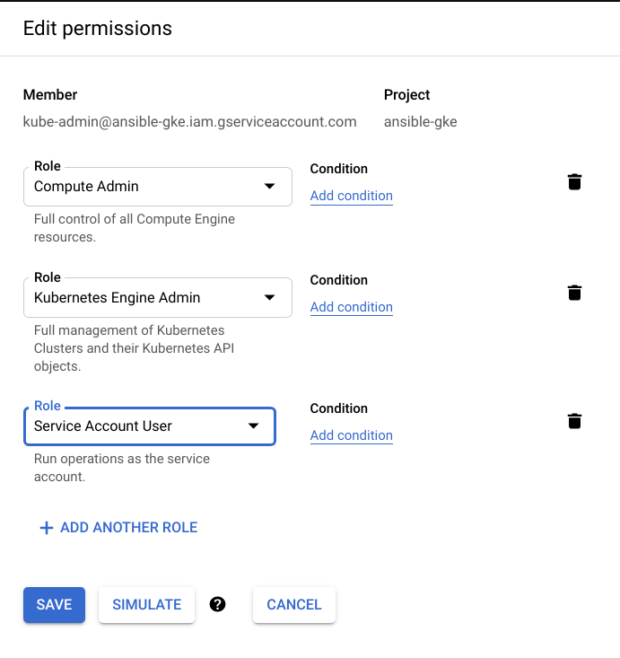

# GCP

## Python libraries

As we will interact with Azure, we need a couple of Python libraries to be present in the system.

```bash
pip install --user -r requirements_gcp.txt
```

## Ansible Collections

We will also need the Ansible [collection for Google Cloud](https://galaxy.ansible.com/google/cloud).

```bash
ansible-galaxy collection install -r collections/requirements.yml
```

## GCP credentials

To authenticate provide the following [environment variables](https://docs.ansible.com/ansible/latest/scenario_guides/guide_gce.html#providing-credentials-as-environment-variables) `GCP_PROJECT`, `GCP_AUTH_KIND`, and `GCP_SERVICE_ACCOUNT_FILE`.

- `GCP_PROJECT`: GCP Project ID.
- `GCP_AUTH_KIND`: The type of credential used (`application`, `machineaccount`, or `serviceaccount`).
- `GCP_SERVICE_ACCOUNT_FILE`: The path of a Service Account JSON file if `serviceaccount` is selected as type.

You need to [grant resource access](https://cloud.google.com/iam/docs/granting-changing-revoking-access#access-control-via-console) to your [service account](https://developers.google.com/identity/protocols/oauth2/service-account#creatinganaccount). For example you can assign these roles: `Compute Admin`, `Kubernetes Engine Admin`, and `Service Account User` (iam.serviceAccountUser).

<p align="center">

</p>

## Service Account JSON file

You need to provide your Service Account JSON file, which you point out to with the environmental variable `GCP_SERVICE_ACCOUNT_FILE`.